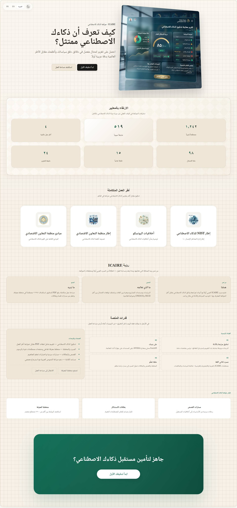
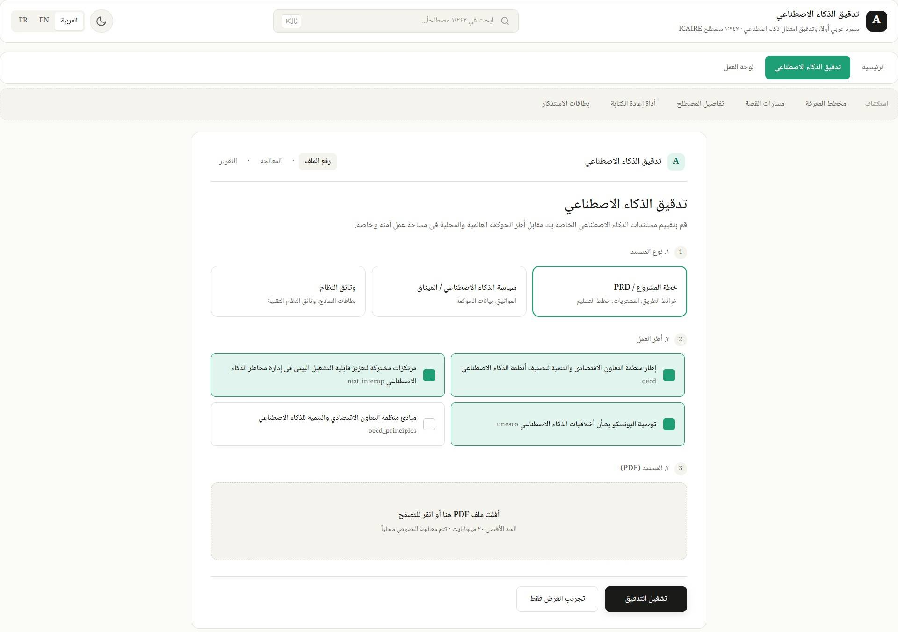
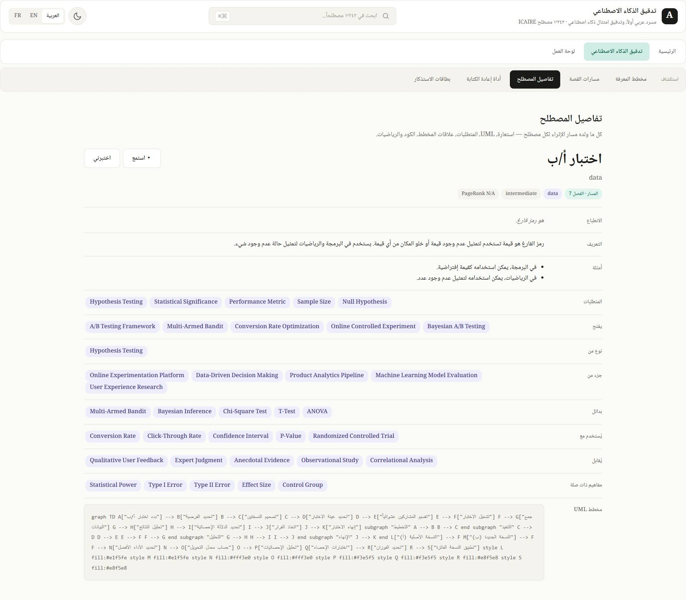
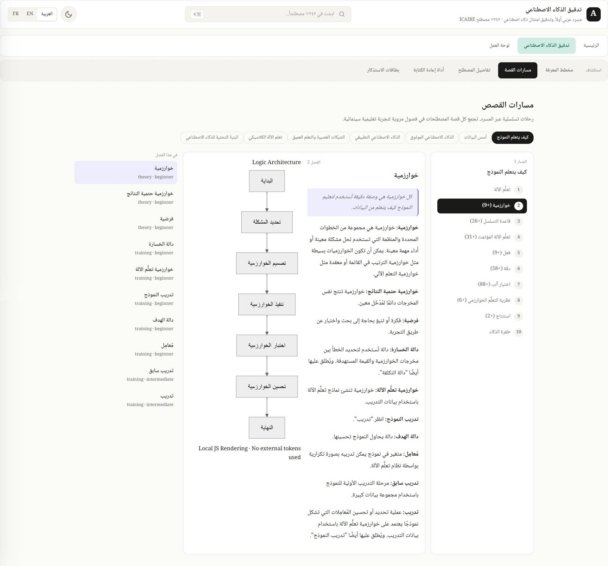
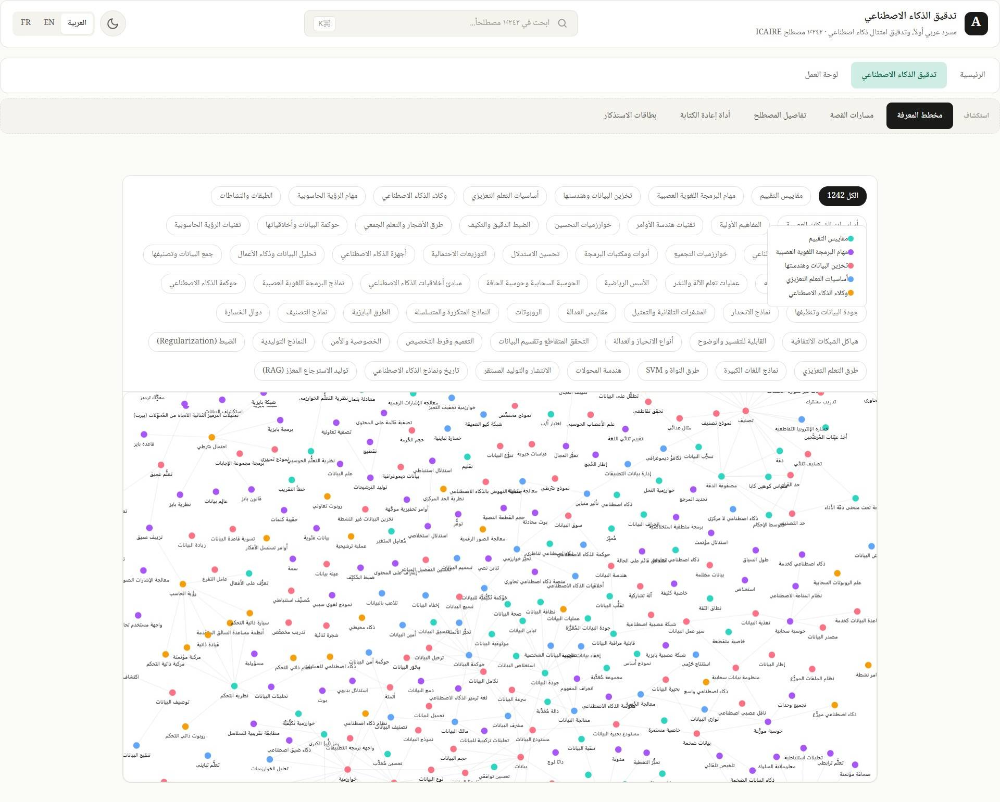
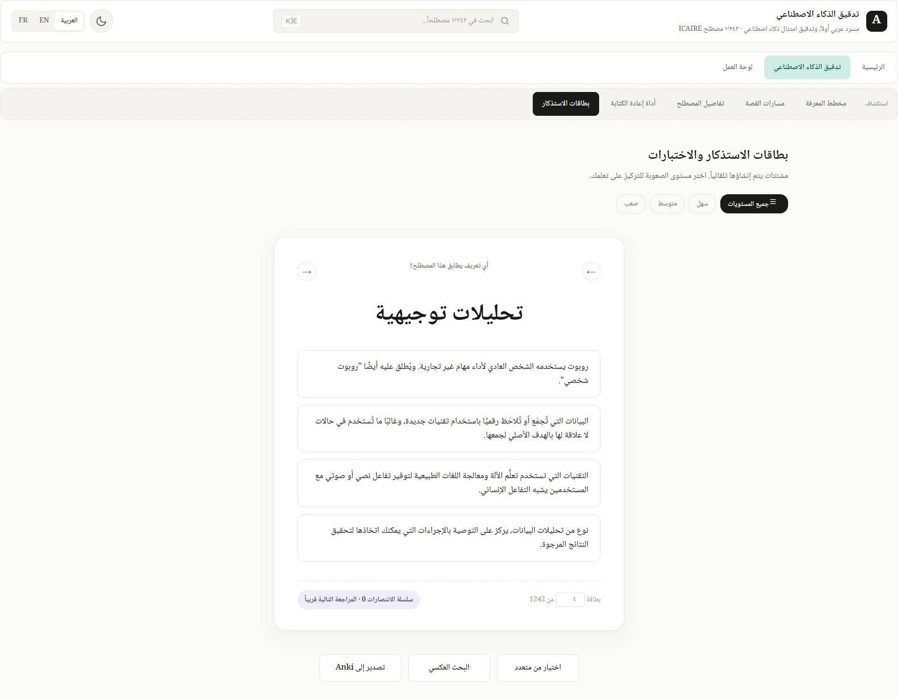
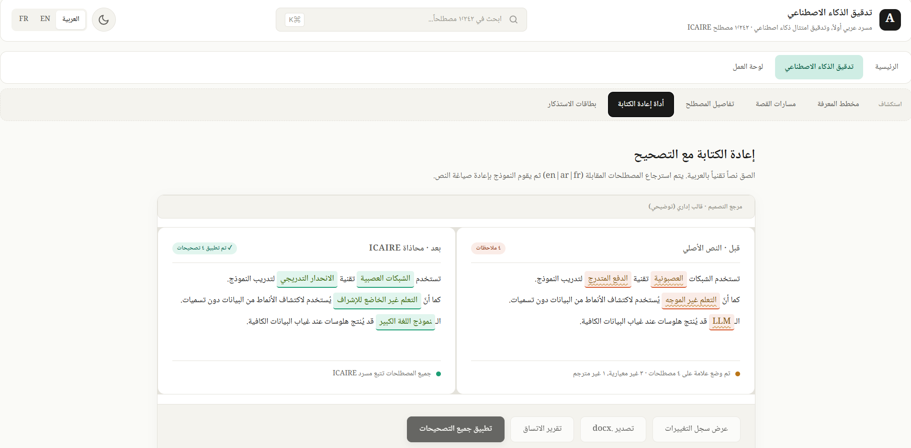
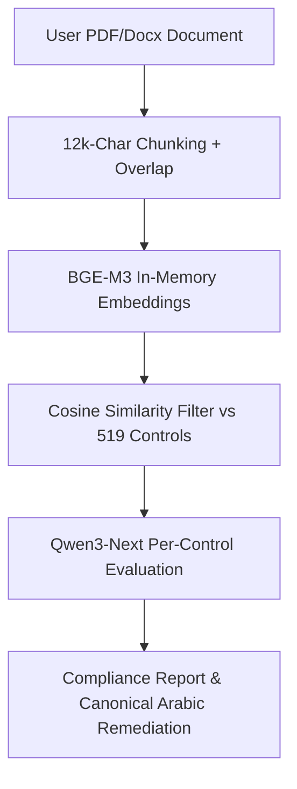

 
# AI-Audit: Arabic-First AI Compliance Auditor & ICAIRE Glossary Living Platform

[](https://huggingface.co/collections/FatimahEmadEldin/ai-audit)
[](https://www.kaggle.com/competitions/ai-context-challenge-by-icaire/writeups/AI-Audit)
[]([https://github.com/astral-fate/Tashkees-AI-at-AbjadMed](https://github.com/astral-fate/term_graph))
[](https://term-graph.pages.dev/)
[](https://creativecommons.org/licenses/by/4.0/)

AI-Audit transforms static AI governance vocabularies into an interactive, multi-layered learning platform and a deployment-ready compliance enforcement tool. Built for the **AI Glossary Challenge by ICAIRE** under **UNESCO patronage** in partnership with **BEYOND Academy**, this system ensures that Arabic-speaking institutions can audit localized AI documentation against international benchmarks using unified, canonical terminology.


 

## 🖥️ Platform Interface Previews & Gallery

Explore the interactive live workspace features of the AI-Audit platform across core pedagogical and evaluation modules:

<table width="100%">
  <tr>
    <td width="50%" valign="top" align="center">
      <h4>Bilingual Home Interface (Arabic Native RTL)</h4>
      
      <p style="font-size: 13px; color: #888; margin-top: 8px;">The default localized RTL user landing workspace establishing immediate access to vocabulary, audit engines, and curriculum tracking.</p>
    </td>
    <td width="50%" valign="top" align="center">
      <h4>Bilingual Home Interface (English LTR)</h4>
      
      <p style="font-size: 13px; color: #888; margin-top: 8px;">Seamless, on-the-fly cross-lingual directional toggle layout maintaining layout structure integrity across dynamic locale states.</p>
    </td>
  </tr>

  <tr>
    <td width="50%" valign="top" align="center">
      <h4>Phase 2 Live Production Compliance Auditor</h4>
      
      <p style="font-size: 13px; color: #888; margin-top: 8px;">Active governance evaluation pane mapping document segments against 519 targets to issue zero-drift canonical Arabic remediations.</p>
    </td>
    <td width="50%" valign="top" align="center">
      <h4>Bilingual Term Matrix Side-Drawer Panel</h4>
      
      <p style="font-size: 13px; color: #888; margin-top: 8px;">Contextual side-drawer showcasing parallel bilingual definitions, misconception profiles, difficulty tiers, and interactive charts.</p>
    </td>
  </tr>

  <tr>
    <td width="50%" valign="top" align="center">
      <h4>Pedagogical Story Tracks & Curriculums</h4>
      
      <p style="font-size: 13px; color: #888; margin-top: 8px;">Visual guide routing terms through 7 thematic series tracks (e.g., Trustworthy AI) to breakdown structural learning dependencies.</p>
    </td>
    <td width="50%" valign="top" align="center">
      <h4>8,400+ Edge Interactive Knowledge Graph</h4>
      
      <p style="font-size: 13px; color: #888; margin-top: 8px;">Interactive semantic relationship layout mapped using localized community split logic and multi-layered importance profiling.</p>
    </td>
  </tr>

  <tr>
    <td width="50%" valign="top" align="center">
      <h4>Gamified Reinforcement Flashcard Engine</h4>
      
      <p style="font-size: 13px; color: #888; margin-top: 8px;">Interactive reinforcement assessment module generating contextual question fields and target-calibrated misconceptions.</p>
    </td>
    <td width="50%" valign="top" align="center">
      <h4>Bilingual Document Context Rewriter</h4>
      
      <p style="font-size: 13px; color: #888; margin-top: 8px;">A native document editing sandbox allowing users to replace mismatched phrasing with approved canonical text blocks in real-time.</p>
    </td>
  </tr>
</table>

 
 

## 🗺️ Project Architecture & Repository Structure

```text
ai-audit/
├── backend/                       # FastAPI Production Auditor Core
│   ├── main.py                    # Server endpoints and runtime router
│   ├── audit_engine.py            # Phase 2 Online RAG & LLM evaluation engine
│   └── requirements.txt           # Backend dependencies
├── frontend/                      # Next.js 15 App Router (RTL native)
│   ├── src/
│   │   ├── app/                   # Dynamic multilingual routing ([locale])
│   │   ├── components/            # Shadcn/ui web elements
│   │   │   ├── audit-drawer.tsx   # <TermLink> side-drawer context window
│   │   │   └── transformer-anatomy/ # Interactive SVG Hotspot explorer
│   │   └── messages/              # Arabic & English structural translation JSONs
│   └── package.json
├── pipelines/                     # Reproducible Enrichment & Indexing Frameworks
│   ├── glossary_enrichment/
│   │   ├── bootstrap.py           # Layer 0: Folder tree generation
│   │   ├── bilingual_enrich.py    # Layer 1: Qwen local 4-bit prompt orchestration
│   │   ├── story_mapper.py        # Layer 2: Narrative track & chapter assignment
│   │   └── graph_extraction.py    # Layer 3-4: Typed edges & network analytics
│   └── framework_indexing/
│       ├── pdf_parser.py          # Framework text harvesting & chunk overlap
│       └── nvim_extractor.py      # Phase 1: Parallel Rubric Generation (NVIDIA NIM)
├── scripts/                       # Gephi, Neo4j, CAT, and Anki compiler tools
│   ├── build_rag_index.py         # Multi-lingual vector database generator
│   └── export_converters.py       # JSON to GEXF, Cypher, TBX, and APKG
└── README.md                      # Comprehensive Project Documentation

```

---

## 🚀 Key Results & Capabilities at a Glance

* **1,242 Terms Deeply Enriched:** Expanded the static 2-sentence baseline into a 12+ field structured knowledge matrix (including parallel bilingual explanations, target difficulty levels, and misconception profiles).


* **8,400+ Typed Semantic Edges:** Formulated an interconnected graph mapping key relationships (`prerequisites`, `unlocks`, `contrasts-with`, `is-a`).


* **519 Extracted Controls:** Processed international frameworks into actionable compliance criteria using high-throughput parallel execution (reducing UNESCO evaluation lag from 100 to 13 minutes).


* **Zero Terminology Drift:** An engineering guardrail ensures the platform cannot generate compliance remediations containing non-canonical Arabic phrasing.


---

## 🛠️ Reproducible Execution Pipelines

### 1. Glossary Enrichment & Ontology Construction (Offline)

The taxonomy pipeline parses the original ICAIRE vocabulary source through structured local execution steps:

```bash
# Execute idempotent layers sequentially. Out-of-memory safe with atomic persistence.
python pipelines/glossary_enrichment/bootstrap.py --source data/icaire_source.csv
python pipelines/glossary_enrichment/bilingual_enrich.py --model Qwen/Qwen2.5-7B-Instruct --quant 4bit
python pipelines/glossary_enrichment/story_mapper.py --tracks 7
python pipelines/glossary_enrichment/graph_extraction.py --resolve fuzzy

```

* **Layers 0-1 (Bootstrap & Context Expansion):** Standardizes directory spaces and builds parallel bilingual hook explanations and synthetic distractors using calibrated local models.


* **Layer 2 (Narrative Track Allocation):** Sorts records into one of seven pedagogical pathways (e.g., *Trustworthy AI*, *Neural Networks*) to clarify cross-concept learning dependencies.


* **Layers 3-4 (Graph Resolution):** Maps text labels using `rapidfuzz`, computes local importance profiles via PageRank metrics, and establishes logical boundaries using Louvain community split evaluations.


* **Layer 5-6 (UML & Knowledge Bundling):** Generates custom localized charts with `Mermaid.js` syntax engine  and builds targeted downstream packages:


* **Graph Formats:** Graph.gexf (Gephi) , Graph.cypher (Neo4j).


* **Translation & Flashcards:** Glossary.tbx (Computer-Assisted Translation) , icaire_glossary.apkg (Anki space).


### 2. Framework Indexing & Alignment (Phase 1 RAG)

```bash
python pipelines/framework_indexing/pdf_parser.py --input_dir data/frameworks_raw/
python pipelines/framework_indexing/nvim_extractor.py --api nvidia_nim --workers 8

```

* Parses and splits PDFs into 12,000-character text frames maintaining a 1,500-character context bridge.


* Leverages high-capacity parameters (`Qwen3-Next-80B`) over multi-threaded workers to produce normalized compliance checklists.


* Anchors compliance requirements directly into core vocabulary spaces via dense cross-lingual vector maps using `BAAI/bge-m3` vectors.


### 3. Production Runtime Auditor (Phase 2 Online RAG)

When a user uploads documentation, the active compliance sequence executes instantly:



1. Captures document content and transforms text segments using active embedding vectors.


2. Measures data arrays against targeted control vectors via cosine distance indices to extract relevant text proofs.


3. Prompts specialized deployment instances to determine active compliance posture, verify grounding evidence, and generate native bilingual structural remediation templates.


---

## 📊 Technical Stack Matrix

* **User Workspace Architecture:** Next.js 15 (Native App Router) , TypeScript , Tailwind CSS , Shadcn/ui , Next-intl (Bi-directional RTL localization framework).


* **Auditing Services Engine:** Production FastAPI wrapper , Hugging Face Spaces environment , NetworkX execution suite.


* **Inference Layer Engines:** Localized Qwen 2.5-7B-Instruct running under 4-bit BitsAndBytes quantization mappings. Cloud-managed Qwen3-Next-80B-A3B-Instruct hosted on NVIDIA NIM instances.


* **Information Engineering Support:** Python-Louvain clustering , RapidFuzz matching models , PyPDF parsing tools.


---

## 🔒 Limitations, Validation Boundaries, & Academic Disclaimer

1. **Model Content Validation Constraints:** Synthesized definitions, distractors, and remediation suggestions have undergone rigorous programmatic checks and statistical sampling but have not yet been fully audited by a human steering panel.


2. **Framework Matching Precision:** System matching relies strictly on cross-lingual embedding metrics. Integrating a secondary LLM verification step will improve alignment accuracy for high-risk requirements.


3. **Regulatory Scope:** Initial release covers UNESCO Ethics, OECD Taxonomies & Principles, and NIST Guideposts. Expanded mappings for regional criteria (SDAIA) and the complete EU AI Act are scheduled for the next release.


4. **Legal Compliance Notice:** This platform serves as an LLM-assisted research tool for compliance verification and does not constitute formal legal advice.


---

## 🌟 Published Datasets & Assets

All artifacts produced by this project are publicly available on Hugging Face under the open-source **CC BY 4.0** license:

* 📦 [Enriched ICAIRE Glossary Dataset](https://huggingface.co/datasets/FatimahEmadEldin/icaire-ai-glossary-enriched) — 1,242 Terms with 12+ semantic attributes, network edges, and Mermaid graphs.


* 📦 [AI-Audit Frameworks Raw Rubric](https://huggingface.co/datasets/FatimahEmadEldin/AI-Audit-frameworks-raw) — 519 Normalized governance controls with structured validation properties.


* 📦 [AI-Audit Frameworks Vector Space](https://huggingface.co/datasets/FatimahEmadEldin/AI-Audit-frameworks-embedded) — Pre-computed cross-lingual token embeddings.


---

## 📝 Citation & Academic Reference

If you build upon this platform, datasets, or ontology architectures in your research, please cite this work as follows:

```bibtex
@software{AI-Audit_Platform_2026,
  author    = {Emad Eldin, Fatimah Mohammad},
  title     = {AI-Audit: Arabic-First AI Compliance Auditor and ICAIRE Glossary Living Platform},
  year      = {2026},
  publisher = {AI Glossary Challenge by ICAIRE under UNESCO patronage},
  url       = {[https://github.com/astral-fate/term_graph](https://github.com/astral-fate/term_graph)}
}

@dataset{AI-Audit_Glossary_Enriched_2026,
  author    = {Emad Eldin, Fatimah Mohammad},
  title     = {Enriched ICAIRE Glossary: Bilingual Hooks, Story Tracks, Typed Graph Edges, and Mermaid UML for 1,242 Terms},
  year      = {2026},
  publisher = {Hugging Face},
  url       = {[https://huggingface.co/datasets/FatimahEmadEldin/icaire-ai-glossary-enriched](https://huggingface.co/datasets/FatimahEmadEldin/icaire-ai-glossary-enriched)}
}

@dataset{AI-Audit_Frameworks_Raw_2026,
  author    = {Emad Eldin, Fatimah Mohammad},
  title     = {AI-Audit Frameworks: ICAIRE-Grounded AI Governance Rubric},
  year      = {2026},
  publisher = {Hugging Face},
  url       = {[https://huggingface.co/datasets/FatimahEmadEldin/AI-Audit-frameworks-raw](https://huggingface.co/datasets/FatimahEmadEldin/AI-Audit-frameworks-raw)}
}

```
